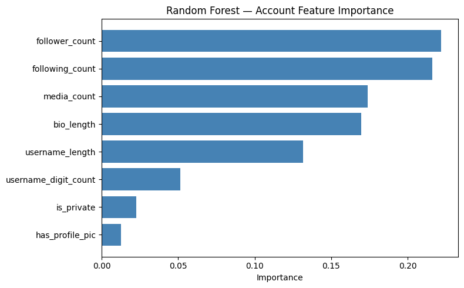
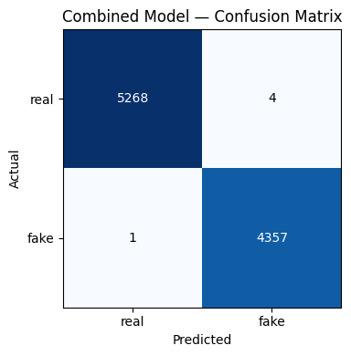

# Create CSV files
For OneDrive Folder with raw data


```python
#installs and imports
#see requirements.txt for full list of dependencies
#!pip install duckdb pyarrow -q

#imports
import json, os, random, duckdb
import pandas as pd
import logging
import numpy as np

os.makedirs('logs', exist_ok=True)
logging.basicConfig(
    level=logging.INFO,
    format='%(asctime)s - %(levelname)s - %(message)s',
    handlers=[
        logging.FileHandler('logs/pipeline.log'),
        logging.StreamHandler()
    ]
)
log = logging.getLogger('pipeline')
log.info("Pipeline initialized.")
```

    2026-03-31 23:21:51,963 - INFO - Pipeline initialized.


```python
#load in json files
#source: https://github.com/fcakyon/instafake-dataset

try: 
    with open("data/fakeAccountData.json") as f:
        fake_data = json.load(f)
    for r in fake_data:
        r['isFake'] = 1
        r['label'] = 'fake'
    log.info(f"Loaded fakeAccountData.json: {len(fake_data)} fake accounts.")

    with open("data/realAccountData.json") as f:
        real_data = json.load(f)
    for r in real_data:
        r['isFake'] = 0
        r['label'] = 'real'
    log.info(f"Loaded realAccountData.json: {len(real_data)} real accounts.")
    df_raw = pd.DataFrame(fake_data + real_data).reset_index(drop=True)
    df_raw['account_id'] = df_raw.index + 1
    log.info(f"Combined dataset: {len(df_raw)} total accounts.")
    log.info(f"Columns in dataset: {df_raw.columns.tolist()}")
except fileNotFoundError as e:
    log.error(f"File not found: {e.filename}")
    raise
except json.JSONDecodeError as e:
    log.error(f"Error decoding JSON: {e.msg} at line {e.lineno} column {e.colno}")
    raise
except Exception as e:
    log.error(f"Unexpected error: {str(e)}")
    raise
df_raw.head()
```

    2026-03-31 23:21:52,154 - INFO - Loaded fakeAccountData.json: 200 fake accounts.


    2026-03-31 23:21:52,243 - INFO - Loaded realAccountData.json: 994 real accounts.
    2026-03-31 23:21:52,287 - INFO - Combined dataset: 1194 total accounts.
    2026-03-31 23:21:52,290 - INFO - Columns in dataset: ['userFollowerCount', 'userFollowingCount', 'userBiographyLength', 'userMediaCount', 'userHasProfilPic', 'userIsPrivate', 'usernameDigitCount', 'usernameLength', 'isFake', 'label', 'account_id']


<div>
<style scoped>
    .dataframe tbody tr th:only-of-type {
        vertical-align: middle;
    }

    .dataframe tbody tr th {
        vertical-align: top;
    }

    .dataframe thead th {
        text-align: right;
    }
</style>
<table border="1" class="dataframe">
  <thead>
    <tr style="text-align: right;">
      <th></th>
      <th>userFollowerCount</th>
      <th>userFollowingCount</th>
      <th>userBiographyLength</th>
      <th>userMediaCount</th>
      <th>userHasProfilPic</th>
      <th>userIsPrivate</th>
      <th>usernameDigitCount</th>
      <th>usernameLength</th>
      <th>isFake</th>
      <th>label</th>
      <th>account_id</th>
    </tr>
  </thead>
  <tbody>
    <tr>
      <th>0</th>
      <td>25</td>
      <td>1937</td>
      <td>0</td>
      <td>0</td>
      <td>1</td>
      <td>1</td>
      <td>0</td>
      <td>10</td>
      <td>1</td>
      <td>fake</td>
      <td>1</td>
    </tr>
    <tr>
      <th>1</th>
      <td>324</td>
      <td>4122</td>
      <td>0</td>
      <td>0</td>
      <td>1</td>
      <td>0</td>
      <td>4</td>
      <td>15</td>
      <td>1</td>
      <td>fake</td>
      <td>2</td>
    </tr>
    <tr>
      <th>2</th>
      <td>15</td>
      <td>399</td>
      <td>0</td>
      <td>0</td>
      <td>0</td>
      <td>0</td>
      <td>3</td>
      <td>12</td>
      <td>1</td>
      <td>fake</td>
      <td>3</td>
    </tr>
    <tr>
      <th>3</th>
      <td>14</td>
      <td>107</td>
      <td>0</td>
      <td>1</td>
      <td>1</td>
      <td>0</td>
      <td>1</td>
      <td>10</td>
      <td>1</td>
      <td>fake</td>
      <td>4</td>
    </tr>
    <tr>
      <th>4</th>
      <td>264</td>
      <td>4651</td>
      <td>0</td>
      <td>0</td>
      <td>1</td>
      <td>0</td>
      <td>0</td>
      <td>14</td>
      <td>1</td>
      <td>fake</td>
      <td>5</td>
    </tr>
  </tbody>
</table>
</div>


```python
#build face_images table
#source: https://www.kaggle.com/datasets/kaustubhdhote/human-faces-dataset
#images stored at data/Human Faces Dataset/

real_path = "data/Human Faces Dataset/Real Images"
fake_path = "data/Human Faces Dataset/AI-Generated Images"

try:
    if not os.path.exists(real_path):
        raise FileNotFoundError(f"Directory not found: {real_path}")
    if not os.path.exists(fake_path):
        raise FileNotFoundError(f"Directory not found: {fake_path}")
    #scan directories for image files
    real_files = sorted([f for f in os.listdir(real_path) if f.lower().endswith(('.jpg', '.jpeg', '.png'))])
    fake_files = sorted([f for f in os.listdir(fake_path) if f.lower().endswith(('.jpg', '.jpeg', '.png'))])

    #log images found
    log.info(f"Found {len(real_files)} real images and {len(fake_files)} fake images.")

    face_images = pd.DataFrame({
        'image_id': range(1, len(real_files) + len(fake_files) + 1),
        'filename': real_files + fake_files,
        'face_type': ['real'] * len(real_files) + ['ai'] * len(fake_files)
    })
    log.info(f"Constructed face_images DataFrame with {len(face_images)} records.")
except FileNotFoundError as e:
    log.error(f"Image folder is missing: {e}")
    raise
except Exception as e:
    log.error(f"Error processing images: {str(e)}")
    raise
face_images.head()

```

    2026-03-31 23:21:52,474 - INFO - Found 5000 real images and 4630 fake images.
    2026-03-31 23:21:52,478 - INFO - Constructed face_images DataFrame with 9630 records.


<div>
<style scoped>
    .dataframe tbody tr th:only-of-type {
        vertical-align: middle;
    }

    .dataframe tbody tr th {
        vertical-align: top;
    }

    .dataframe thead th {
        text-align: right;
    }
</style>
<table border="1" class="dataframe">
  <thead>
    <tr style="text-align: right;">
      <th></th>
      <th>image_id</th>
      <th>filename</th>
      <th>face_type</th>
    </tr>
  </thead>
  <tbody>
    <tr>
      <th>0</th>
      <td>1</td>
      <td>000001.jpg</td>
      <td>real</td>
    </tr>
    <tr>
      <th>1</th>
      <td>2</td>
      <td>000002.jpg</td>
      <td>real</td>
    </tr>
    <tr>
      <th>2</th>
      <td>3</td>
      <td>000003.jpg</td>
      <td>real</td>
    </tr>
    <tr>
      <th>3</th>
      <td>4</td>
      <td>000004.jpg</td>
      <td>real</td>
    </tr>
    <tr>
      <th>4</th>
      <td>5</td>
      <td>000005.jpg</td>
      <td>real</td>
    </tr>
  </tbody>
</table>
</div>


```python
#assigning a face image to each account
#real accounts get real images, fake accounts get ai images

try:
    random.seed(42)  #for reproducibility
    read_ids = face_images[face_images['face_type'] == 'real']['image_id'].tolist()
    ai_ids = face_images[face_images['face_type'] == 'ai']['image_id'].tolist()
    df_raw['profile_pic_id'] = df_raw['label'].apply(
        lambda x : random.choice(read_ids) if x == 'real' else random.choice(ai_ids)
    )

    log.info("Assigned profile picture id to accounts.")
    log.info(f"Sample of assigned profile_pic_id:\n{df_raw[['account_id', 'label', 'profile_pic_id']].head()}")
except Exception as e:
    log.error(f"Error assigning profile pictures: {str(e)}")
    raise
```

    2026-03-31 23:21:52,591 - INFO - Assigned profile picture id to accounts.
    2026-03-31 23:21:52,609 - INFO - Sample of assigned profile_pic_id:
       account_id label  profile_pic_id
    0           1  fake            5913
    1           2  fake            5205
    2           3  fake            7254
    3           4  fake            7007
    4           5  fake            6829


```python
#generate synthetic data for accounts without profile pics
try:
    n_real_accounts = len(df_raw)
    n_total_images = len(face_images)
    n_synthetic = n_total_images - n_real_accounts
    log.info(f"Generating {n_synthetic} synthetic accounts to match total images.")

    #learning distributions from real data
    #numeric columns will use normal distributions, categorical columns will use empirical probability

    #sample n values from a normal fit to col, clipped to a valid range
    def sample_col(col, n, clip_min=0, clip_max=None):
        mu, sigma = df_raw[col].mean(), df_raw[col].std()
        vals = np.random.normal(mu, sigma, n).round().astype(int)
        vals = np.clip(vals, clip_min, clip_max if clip_max else vals.max())
        return vals
    np.random.seed(42)
    synthetic_labels = np.random.choice(['real', 'fake'], size=n_synthetic, p=[0.5,0.5])

    df_synthetic = pd.DataFrame({
        'account_id': range(n_real_accounts + 1,
                            n_real_accounts + n_synthetic + 1),
        'label': synthetic_labels,
        'isFake': (synthetic_labels == 'fake').astype(int),
        'is_synthetic': True,

        #stats
        'userFollowerCount': sample_col('userFollowerCount',   n_synthetic,
                                           clip_min=0, clip_max=4492),
        'userFollowingCount': sample_col('userFollowingCount',  n_synthetic,
                                           clip_min=0, clip_max=7497),
        'userMediaCount': sample_col('userMediaCount',      n_synthetic,
                                           clip_min=0, clip_max=1058),

        #profile
        'userBiographyLength': sample_col('userBiographyLength', n_synthetic,
                                           clip_min=0, clip_max=150),
        'userHasProfilPic': np.random.binomial(
                                   1, df_raw['userHasProfilPic'].mean(),
                                   n_synthetic),
        'userIsPrivate': np.random.binomial(
                                   1, df_raw['userIsPrivate'].mean(),
                                   n_synthetic),
        'usernameDigitCount': sample_col('usernameDigitCount',  n_synthetic,
                                           clip_min=0, clip_max=10),
        'usernameLength': sample_col('usernameLength',      n_synthetic,
                                           clip_min=5, clip_max=30),
    })

    log.info(f"Synthetic data generated: {df_synthetic.shape}")
    log.info(f"Synthetic label split:\n{df_synthetic['label'].value_counts().to_string()}")

except Exception as e:
    log.error(f"Error generating synthetic accounts: {e}")
    raise
```

    2026-03-31 23:21:52,633 - INFO - Generating 8436 synthetic accounts to match total images.
    2026-03-31 23:21:52,675 - INFO - Synthetic data generated: (8436, 12)
    2026-03-31 23:21:52,684 - INFO - Synthetic label split:
    label
    real    4278
    fake    4158


```python
#combine real and synthetic dataframes and assign the remaining images

try:
    df_raw['is_synthetic'] = False

    #combined
    df_all = pd.concat([df_raw, df_synthetic], ignore_index=True)
    df_all['account_id'] = df_all.index + 1  #reassign account_id to be unique and sequential

    log.info(f"Combined real and synthetic data: {df_all.shape}")
    log.info(f"Final label distribution:\n{df_all['label'].value_counts().to_string()}")

    #assign remaining images
    face_images_shuffled = face_images.copy()

    real_img_ids = face_images_shuffled[face_images_shuffled['face_type'] == 'real']['image_id'].tolist()
    ai_img_ids = face_images_shuffled[face_images_shuffled['face_type'] == 'ai']['image_id'].tolist()

    random.seed(42)
    random.shuffle(real_img_ids)
    random.shuffle(ai_img_ids)

    real_iter = iter(real_img_ids)
    ai_iter = iter(ai_img_ids)

    #assign real images to real accounts, ai images to fake accounts randomly
    #switched from filename to profile_pic_id
    def assign_unique(label):
        try:
            return next(real_iter) if label == 'real' else next(ai_iter)
        except StopIteration:
            return random.choice(real_img_ids if label == 'real' else ai_img_ids)

    df_all['profile_pic_id'] = df_all['label'].apply(assign_unique)

    log.info("Assigned profile pictures to all accounts.")
    log.info(f"Sample of final dataset:\n{df_all[['account_id', 'label', 'is_synthetic', 'profile_pic_id']].head()}")

except Exception as e:
    log.error(f"Error combining datasets and assigning images: {e}")
    raise
```

    2026-03-31 23:21:52,711 - INFO - Combined real and synthetic data: (9630, 13)
    2026-03-31 23:21:52,717 - INFO - Final label distribution:
    label
    real    5272
    fake    4358
    2026-03-31 23:21:52,740 - INFO - Assigned profile pictures to all accounts.
    2026-03-31 23:21:52,745 - INFO - Sample of final dataset:
       account_id label  is_synthetic  profile_pic_id
    0           1  fake         False            7409
    1           2  fake         False            5840
    2           3  fake         False            8423
    3           4  fake         False            5191
    4           5  fake         False            6494


```python
# normalize into 4 relational tables
#accounts, accounts_stats, account_profile, face_images (made previously)

try: 
    accounts = df_all[['account_id', 'label', 'isFake', 'profile_pic_id']].copy()

    account_stats = df_all[['account_id',
                             'userFollowerCount',
                             'userFollowingCount',
                             'userMediaCount']].copy()
    account_stats.columns = ['account_id', 'follower_count',
                              'following_count', 'media_count']

    account_profile = df_all[['account_id',
                               'userBiographyLength',
                               'userHasProfilPic',
                               'userIsPrivate',
                               'usernameDigitCount',
                               'usernameLength']].copy()
    account_profile.columns = ['account_id', 'bio_length', 'has_profile_pic',
                                'is_private', 'username_digit_count', 'username_length']

    for name, tbl in [('accounts', accounts),
                      ('account_stats', account_stats),
                      ('account_profile', account_profile),
                      ('face_images', face_images)]:
        log.info(f"Table '{name}': {tbl.shape[0]} rows x {tbl.shape[1]} cols")

except KeyError as e:
    log.error(f"Column not found, check if JSON field names match: {e}")
    raise
except Exception as e:
    log.error(f"Error normalizing tables: {e}")
    raise
```

    2026-03-31 23:21:52,771 - INFO - Table 'accounts': 9630 rows x 4 cols
    2026-03-31 23:21:52,773 - INFO - Table 'account_stats': 9630 rows x 4 cols
    2026-03-31 23:21:52,775 - INFO - Table 'account_profile': 9630 rows x 6 cols
    2026-03-31 23:21:52,777 - INFO - Table 'face_images': 9630 rows x 3 cols


```python
#export as CSV

try:
    os.makedirs("data/csv/", exist_ok=True)
    accounts.to_csv("data/csv/accounts.csv", index=False)
    account_stats.to_csv("data/csv/account_stats.csv", index=False)
    account_profile.to_csv("data/csv/account_profile.csv", index=False)
    face_images.to_csv("data/csv/face_images.csv", index=False)

    total = sum(os.path.getsize(f"data/csv/{fname}") for fname in os.listdir("data/csv/") if fname.endswith('.csv'))

    log.info(f"CSVs written to 'data/csv/' with total size {total / 1024:.1f} KB")

except PermissionError as e:
    log.error(f"Permission error writing CSV: {e}")
    raise
except Exception as e:
    log.error(f"Error exporting CSVs: {e}")
    raise
```

    2026-03-31 23:21:52,904 - INFO - CSVs written to 'data/csv/' with total size 643.3 KB


```python
#export as parquet

try:
    os.makedirs("data/parquet/", exist_ok=True)
    accounts.to_parquet("data/parquet/accounts.parquet", index=False)
    account_stats.to_parquet("data/parquet/account_stats.parquet", index=False)
    account_profile.to_parquet("data/parquet/account_profile.parquet", index=False)
    face_images.to_parquet("data/parquet/face_images.parquet", index=False)

    total = sum(os.path.getsize(f"data/parquet/{fname}") for fname in os.listdir("data/parquet/") if fname.endswith('.parquet'))

    log.info(f"Parquets written to 'data/parquet/' with total size {total / 1024:.1f} KB")
except Exception as e:
    log.error(f"Error exporting Parquets: {e}")
    raise
```

    2026-03-31 23:21:53,217 - INFO - Parquets written to 'data/parquet/' with total size 400.7 KB


# Data Preparation

*Loads face image and account data files into a DuckDB database using Python.*


```python
#load into duckdb and turn tables into duckdb tables for querying

try:
    con = duckdb.connect("data/fake_detection.duckdb")
    log.info("Connected to DuckDB.")

    tables = {
        'accounts': "data/parquet/accounts.parquet",
        'account_stats': "data/parquet/account_stats.parquet",
        'account_profile': "data/parquet/account_profile.parquet",
        'face_images': "data/parquet/face_images.parquet"
    }
    for name, path in tables.items():
        con.execute(f"CREATE OR REPLACE TABLE {name} AS SELECT * FROM read_parquet('{path}')")
        n = con.execute(f"SELECT COUNT(*) FROM {name}").fetchone()[0]
        log.info(f"Loaded table '{name}' from {path} with {n} rows")

except duckdb.Error as e:
    log.error(f"DuckDB error: {e}")
    raise
except Exception as e:
    log.error(f"Error loading data into DuckDB: {e}")
    raise
```

    2026-03-31 23:21:54,076 - INFO - Connected to DuckDB.
    2026-03-31 23:21:54,133 - INFO - Loaded table 'accounts' from data/parquet/accounts.parquet with 9630 rows
    2026-03-31 23:21:54,161 - INFO - Loaded table 'account_stats' from data/parquet/account_stats.parquet with 9630 rows
    2026-03-31 23:21:54,193 - INFO - Loaded table 'account_profile' from data/parquet/account_profile.parquet with 9630 rows
    2026-03-31 23:21:54,223 - INFO - Loaded table 'face_images' from data/parquet/face_images.parquet with 9630 rows


## Query

*SQL queries to explore the data and prepare features for modeling.*


```python
#join all tables for a model-ready flat table

try: 
    df_model_ready = con.execute("""
        SELECT
            a.account_id,
            a.label,
            a.isFake,
            p.bio_length,
            p.has_profile_pic,
            p.is_private,
            p.username_digit_count,
            p.username_length,
            s.follower_count,
            s.following_count,
            s.media_count,
            f.image_id AS profile_pic_id,
            f.face_type AS profile_pic_type,
            f.filename AS profile_pic_filename
        FROM accounts a
            JOIN account_stats s ON a.account_id = s.account_id
            JOIN account_profile p ON a.account_id = p.account_id
            JOIN face_images f ON a.profile_pic_id = f.image_id""").df()
    log.info(f"Joined tables into model-ready DataFrame with {df_model_ready.shape[0]} rows and {df_model_ready.shape[1]} columns.")
except duckdb.Error as e:
    log.error(f"DuckDB query error: {e}")
    raise
except Exception as e:
    log.error(f"Error joining tables: {e}")
    raise

df_model_ready.head()                                
```

    2026-03-31 23:21:54,276 - INFO - Joined tables into model-ready DataFrame with 9630 rows and 14 columns.


<div>
<style scoped>
    .dataframe tbody tr th:only-of-type {
        vertical-align: middle;
    }

    .dataframe tbody tr th {
        vertical-align: top;
    }

    .dataframe thead th {
        text-align: right;
    }
</style>
<table border="1" class="dataframe">
  <thead>
    <tr style="text-align: right;">
      <th></th>
      <th>account_id</th>
      <th>label</th>
      <th>isFake</th>
      <th>bio_length</th>
      <th>has_profile_pic</th>
      <th>is_private</th>
      <th>username_digit_count</th>
      <th>username_length</th>
      <th>follower_count</th>
      <th>following_count</th>
      <th>media_count</th>
      <th>profile_pic_id</th>
      <th>profile_pic_type</th>
      <th>profile_pic_filename</th>
    </tr>
  </thead>
  <tbody>
    <tr>
      <th>0</th>
      <td>407</td>
      <td>real</td>
      <td>0</td>
      <td>0</td>
      <td>1</td>
      <td>1</td>
      <td>0</td>
      <td>9</td>
      <td>253</td>
      <td>303</td>
      <td>7</td>
      <td>1</td>
      <td>real</td>
      <td>000001.jpg</td>
    </tr>
    <tr>
      <th>1</th>
      <td>2225</td>
      <td>real</td>
      <td>0</td>
      <td>54</td>
      <td>1</td>
      <td>0</td>
      <td>0</td>
      <td>7</td>
      <td>368</td>
      <td>1900</td>
      <td>155</td>
      <td>2</td>
      <td>real</td>
      <td>000002.jpg</td>
    </tr>
    <tr>
      <th>2</th>
      <td>9357</td>
      <td>real</td>
      <td>0</td>
      <td>40</td>
      <td>1</td>
      <td>0</td>
      <td>2</td>
      <td>13</td>
      <td>295</td>
      <td>0</td>
      <td>54</td>
      <td>3</td>
      <td>real</td>
      <td>000003.jpg</td>
    </tr>
    <tr>
      <th>3</th>
      <td>8242</td>
      <td>real</td>
      <td>0</td>
      <td>70</td>
      <td>1</td>
      <td>1</td>
      <td>0</td>
      <td>9</td>
      <td>918</td>
      <td>1371</td>
      <td>96</td>
      <td>4</td>
      <td>real</td>
      <td>000004.jpg</td>
    </tr>
    <tr>
      <th>4</th>
      <td>8839</td>
      <td>real</td>
      <td>0</td>
      <td>63</td>
      <td>1</td>
      <td>1</td>
      <td>2</td>
      <td>9</td>
      <td>428</td>
      <td>0</td>
      <td>39</td>
      <td>5</td>
      <td>real</td>
      <td>000005.jpg</td>
    </tr>
  </tbody>
</table>
</div>


# Solution analysis

*A fine-tuned MobileNetV2 CNN detects AI-generated profile pictures, and a Random Forest classifier detects fake account behavior from metadata. Predictions are combined into a final detection score.*


```python
#install tensorflow for modeling
#%pip install tensorflow -q
```


```python
#imports
import tensorflow as tf
from tensorflow.keras.applications import MobileNetV2
from tensorflow.keras.layers import GlobalAveragePooling2D, Dense, Dropout
from tensorflow.keras.models import Model, load_model
from tensorflow.keras.preprocessing.image import ImageDataGenerator
import numpy as np

log.info(f"TensorFlow version: {tf.__version__}")
```

    WARNING: All log messages before absl::InitializeLog() is called are written to STDERR
    I0000 00:00:1775013715.908409   12260 port.cc:153] oneDNN custom operations are on. You may see slightly different numerical results due to floating-point round-off errors from different computation orders. To turn them off, set the environment variable `TF_ENABLE_ONEDNN_OPTS=0`.
    I0000 00:00:1775013718.057440   12260 cpu_feature_guard.cc:227] This TensorFlow binary is optimized to use available CPU instructions in performance-critical operations.
    To enable the following instructions: AVX2 AVX512F AVX512_VNNI FMA, in other operations, rebuild TensorFlow with the appropriate compiler flags.
    WARNING: All log messages before absl::InitializeLog() is called are written to STDERR
    I0000 00:00:1775013724.573349   12260 port.cc:153] oneDNN custom operations are on. You may see slightly different numerical results due to floating-point round-off errors from different computation orders. To turn them off, set the environment variable `TF_ENABLE_ONEDNN_OPTS=0`.
    2026-03-31 23:22:08,519 - INFO - TensorFlow version: 2.21.0


```python
#build image dataset from df_model_ready

try:
    #build dataframe with full path + binary label
    def get_full_path(row):
        if row['profile_pic_type'] == 'real':
            return os.path.join(real_path, row['profile_pic_filename'])
        else:
            return os.path.join(fake_path, row['profile_pic_filename'])
        
    df_images = df_model_ready[['profile_pic_filename', 'profile_pic_type']].copy()
    df_images['full_path'] = df_images.apply(get_full_path, axis=1)
    df_images['label_binary'] = (df_images['profile_pic_type'] == 'ai').astype(int)

    #verify files exist
    missing = df_images[~df_images['full_path'].apply(os.path.exists)]
    if len(missing) > 0:
        log.warning(f"{len(missing)} image files not found on disk")
    else:
        log.info(f"All {len(df_images)} image files verified on disk")

    log.info(f"Image dataset: {df_images['profile_pic_type'].value_counts().to_string()}")

except Exception as e:
    log.error(f"Error building image dataset: {e}")
    raise

df_images.head()
```

    2026-03-31 23:22:25,605 - INFO - All 9630 image files verified on disk
    2026-03-31 23:22:25,614 - INFO - Image dataset: profile_pic_type
    real    5272
    ai      4358


<div>
<style scoped>
    .dataframe tbody tr th:only-of-type {
        vertical-align: middle;
    }

    .dataframe tbody tr th {
        vertical-align: top;
    }

    .dataframe thead th {
        text-align: right;
    }
</style>
<table border="1" class="dataframe">
  <thead>
    <tr style="text-align: right;">
      <th></th>
      <th>profile_pic_filename</th>
      <th>profile_pic_type</th>
      <th>full_path</th>
      <th>label_binary</th>
    </tr>
  </thead>
  <tbody>
    <tr>
      <th>0</th>
      <td>000001.jpg</td>
      <td>real</td>
      <td>data/Human Faces Dataset/Real Images/000001.jpg</td>
      <td>0</td>
    </tr>
    <tr>
      <th>1</th>
      <td>000002.jpg</td>
      <td>real</td>
      <td>data/Human Faces Dataset/Real Images/000002.jpg</td>
      <td>0</td>
    </tr>
    <tr>
      <th>2</th>
      <td>000003.jpg</td>
      <td>real</td>
      <td>data/Human Faces Dataset/Real Images/000003.jpg</td>
      <td>0</td>
    </tr>
    <tr>
      <th>3</th>
      <td>000004.jpg</td>
      <td>real</td>
      <td>data/Human Faces Dataset/Real Images/000004.jpg</td>
      <td>0</td>
    </tr>
    <tr>
      <th>4</th>
      <td>000005.jpg</td>
      <td>real</td>
      <td>data/Human Faces Dataset/Real Images/000005.jpg</td>
      <td>0</td>
    </tr>
  </tbody>
</table>
</div>


```python
#train and validate split for images
from sklearn.model_selection import train_test_split

try:
    train_df, val_df = train_test_split(
        df_images,
        test_size=0.2,
        random_state=42,
        stratify=df_images['profile_pic_type']
    )

    log.info(f"Train set: {len(train_df)} images")
    log.info(f"Val set:   {len(val_df)} images")

except Exception as e:
    log.error(f"Error splitting image data: {e}")
    raise
```

    2026-03-31 23:22:25,833 - INFO - Train set: 7704 images
    2026-03-31 23:22:25,834 - INFO - Val set:   1926 images


```python
#image data generators 
#MobileNetV2 expects 224x224 images, so we will resize and rescale pixel values
IMG_SIZE  = (224, 224)
BATCH     = 32

train_gen = ImageDataGenerator(
    rescale=1./127.5,
    preprocessing_function=lambda x: x - 1,  # scale to [-1, 1]
    horizontal_flip=True,
    rotation_range=10,
    zoom_range=0.1
)

val_gen = ImageDataGenerator(
    rescale=1./127.5,
    preprocessing_function=lambda x: x - 1
)

train_flow = train_gen.flow_from_dataframe(
    train_df,
    x_col='full_path',
    y_col='profile_pic_type',
    target_size=IMG_SIZE,
    batch_size=BATCH,
    class_mode='binary',
    classes=['real', 'ai'],   # real=0, ai=1
    shuffle=True,
    seed=42
)

val_flow = val_gen.flow_from_dataframe(
    val_df,
    x_col='full_path',
    y_col='profile_pic_type',
    target_size=IMG_SIZE,
    batch_size=BATCH,
    class_mode='binary',
    classes=['real', 'ai'],
    shuffle=False
)

log.info(f"Train batches: {len(train_flow)}, Val batches: {len(val_flow)}")

```

    Found 7704 validated image filenames belonging to 2 classes.
    Found 1926 validated image filenames belonging to 2 classes.


    2026-03-31 23:22:41,981 - INFO - Train batches: 241, Val batches: 61


```python
#build a MobileNetV2 model
try:
    base_model = MobileNetV2(
        input_shape=(*IMG_SIZE, 3),
        include_top=False,       #remove ImageNet classification head
        weights='imagenet'       #use pretrained weights
    )

    #freeze base layers, so we only train our custom head
    base_model.trainable = False

    #add custom classification head
    x = base_model.output
    x = GlobalAveragePooling2D()(x)
    x = Dropout(0.3)(x)
    x = Dense(128, activation='relu')(x)
    x = Dropout(0.3)(x)
    output = Dense(1, activation='sigmoid')(x)   #binary: real vs ai

    cnn_model = Model(inputs=base_model.input, outputs=output)

    cnn_model.compile(
        optimizer=tf.keras.optimizers.Adam(learning_rate=1e-4),
        loss='binary_crossentropy',
        metrics=['accuracy']
    )

    log.info(f"MobileNetV2 model built")
    log.info(f"Trainable params: {sum([tf.size(w).numpy() for w in cnn_model.trainable_weights]):,}")

except Exception as e:
    log.error(f"Error building CNN model: {e}")
    raise
```

    E0000 00:00:1775013762.112517   12260 cuda_platform.cc:52] failed call to cuInit: INTERNAL: CUDA error: Failed call to cuInit: UNKNOWN ERROR (303)
    2026-03-31 23:22:43,883 - INFO - MobileNetV2 model built
    2026-03-31 23:22:43,895 - INFO - Trainable params: 164,097


```python
#train the cnn
MODEL_PATH = "models/mobilenet_facedetector.h5"

#train only the custom head with frozen base layers 
try:
    if os.path.exists(MODEL_PATH):
        cnn_model = load_model(MODEL_PATH)
        log.info(f"Loaded existing model from {MODEL_PATH}")
    else:
        log.info("No saved model found, starting training from scratch.")
        history = cnn_model.fit(
            train_flow,
            epochs=5,
            validation_data=val_flow,
            callbacks=[
                tf.keras.callbacks.EarlyStopping(
                    patience=2,
                    restore_best_weights=True
                )
            ]
        )

        os.makedirs("models", exist_ok=True)
        cnn_model.save("models/mobilenet_facedetector.h5")
        log.info("CNN training complete, model saved to models/mobilenet_facedetector.h5")

except Exception as e:
    log.error(f"Error training CNN: {e}")
    raise
```

    2026-03-31 23:22:45,522 - WARNING - Compiled the loaded model, but the compiled metrics have yet to be built. `model.compile_metrics` will be empty until you train or evaluate the model.
    2026-03-31 23:22:45,541 - INFO - Loaded existing model from models/mobilenet_facedetector.h5


```python
#evaluate cnn
from sklearn.metrics import classification_report, confusion_matrix
cnn_classification_report_path = "models/cnn_classification_report.txt"

try:
    if os.path.exists(cnn_classification_report_path):
        with open(cnn_classification_report_path, "r") as f:
            report = f.read()
        log.info(f"Loaded existing CNN classification report from {cnn_classification_report_path}")
    else:
        val_preds_prob = cnn_model.predict(val_flow)
        val_preds = (val_preds_prob > 0.5).astype(int).flatten()
        val_true  = val_flow.labels

        log.info("CNN Classification Report:")
        report = classification_report(val_true, val_preds,
                                    target_names=['real', 'ai'])
        log.info(f"\n{report}")
        print(report)

        cm = confusion_matrix(val_true, val_preds)
        log.info(f"Confusion matrix:\n{cm}")
        with open("models/cnn_classification_report.txt", "w") as f:
            f.write(report)
        log.info("CNN classification report saved to models/cnn_classification_report.txt")

except Exception as e:
    log.error(f"Error evaluating CNN: {e}")
    raise
```

    2026-03-31 23:22:45,564 - INFO - Loaded existing CNN classification report from models/cnn_classification_report.txt


```python
#random forest on the other account features
from sklearn.ensemble import RandomForestClassifier
from sklearn.metrics import classification_report, confusion_matrix
from sklearn.model_selection import train_test_split
from sklearn.preprocessing import LabelEncoder
import joblib

RF_classification_report_path = "models/rf_classification_report.txt"
RF_path = "models/random_forest_accounts.joblib"

#define whether we train a new model or load in 
feature_cols = ['follower_count', 'following_count', 'media_count',
                'bio_length', 'has_profile_pic', 'is_private',
                'username_digit_count', 'username_length']

try:
    if os.path.exists(RF_path):
        rf = joblib.load(RF_path)
        log.info(f"Loaded existing Random Forest model from {RF_path}")
        with open(RF_classification_report_path, "r") as f:
            report = f.read()
        log.info(f"Loaded existing Random Forest classification report from {RF_classification_report_path}")
    else:
        X = df_model_ready[feature_cols]
        y = df_model_ready['isFake']

        X_train, X_test, y_train, y_test = train_test_split(
            X, y, test_size=0.2, random_state=42, stratify=y
        )

        rf = RandomForestClassifier(
            n_estimators=100,
            class_weight='balanced',  #handles imbalanced fake/real ratio
            random_state=42,
            n_jobs=-1
        )
        rf.fit(X_train, y_train)

        y_pred = rf.predict(X_test)
        log.info("Random Forest Classification Report:")
        report = classification_report(y_test, y_pred,
                                    target_names=['real', 'fake'])
        log.info(f"\n{report}")
        print(report)

        cm = confusion_matrix(y_test, y_pred)
        log.info(f"Confusion matrix:\n{cm}")

        #save model
        joblib.dump(rf, "models/random_forest_accounts.joblib")
        log.info("Random Forest saved to models/random_forest_accounts.joblib")

        with open("models/rf_classification_report.txt", "w") as f:
            f.write(report)
        log.info("RF classification report saved to models/rf_classification_report.txt")

except Exception as e:
    log.error(f"Error training Random Forest: {e}")
    raise
```

    2026-03-31 23:31:32,681 - INFO - Loaded existing Random Forest model from models/random_forest_accounts.joblib
    2026-03-31 23:31:32,727 - INFO - Loaded existing Random Forest classification report from models/rf_classification_report.txt


```python
#combined model : merge CNN + RF predictions
# For each account we have:
#   CNN score  : probability that profile pic is AI-generated (0=real, 1=ai)
#   RF score   : probability that account behavior is fake (0=real, 1=fake)
#final score = average of both, threshold at 0.5
PREDS_PATH = "models/combined_predictions.parquet"

try:
    if os.path.exists(PREDS_PATH):
        #load saved predictions instead of rerunning
    #get RF probabilities on full dataset
        saved_preds = pd.read_parquet(PREDS_PATH)
        df_model_ready['rf_prob']       = saved_preds['rf_prob'].values
        df_model_ready['cnn_prob']      = saved_preds['cnn_prob'].values
        df_model_ready['combined_prob'] = saved_preds['combined_prob'].values
        df_model_ready['combined_pred'] = saved_preds['combined_pred'].values
        log.info("Loaded saved predictions from disk — skipping inference")
    else:
        #get RF probabilities on full dataset
        X_all = df_model_ready[feature_cols]
        rf_probs = rf.predict_proba(X_all)[:, 1]  #P(fake)

        #CNN was only run on val set, for full dataset re-run on all images
        all_gen = val_gen.flow_from_dataframe(
            df_images,
            x_col='full_path',
            y_col='profile_pic_type',
            target_size=(224, 224),
            batch_size=32,
            class_mode='binary',
            classes=['real', 'ai'],
            shuffle=False
        )
        cnn_probs_all = cnn_model.predict(all_gen).flatten()

        #combined score
        df_model_ready['rf_prob']       = rf_probs
        df_model_ready['cnn_prob']      = cnn_probs_all
        df_model_ready['combined_prob'] = (rf_probs + cnn_probs_all) / 2
        df_model_ready['combined_pred'] = (df_model_ready['combined_prob'] > 0.5).astype(int)

        # save for next time
        df_model_ready[['rf_prob', 'cnn_prob',
                         'combined_prob', 'combined_pred']].to_parquet(PREDS_PATH)
        log.info(f"Predictions saved to {PREDS_PATH}")
        log.info(f"Combined prediction distribution:\n{df_model_ready['combined_pred'].value_counts().to_string()}")

except Exception as e:
    log.error(f"Error generating combined predictions: {e}")
    raise

df_model_ready[['account_id', 'label', 'isFake', 'rf_prob',
                'cnn_prob', 'combined_prob', 'combined_pred']].head(10)
```

    2026-03-31 23:31:37,413 - INFO - Loaded saved predictions from disk — skipping inference


<div>
<style scoped>
    .dataframe tbody tr th:only-of-type {
        vertical-align: middle;
    }

    .dataframe tbody tr th {
        vertical-align: top;
    }

    .dataframe thead th {
        text-align: right;
    }
</style>
<table border="1" class="dataframe">
  <thead>
    <tr style="text-align: right;">
      <th></th>
      <th>account_id</th>
      <th>label</th>
      <th>isFake</th>
      <th>rf_prob</th>
      <th>cnn_prob</th>
      <th>combined_prob</th>
      <th>combined_pred</th>
    </tr>
  </thead>
  <tbody>
    <tr>
      <th>0</th>
      <td>407</td>
      <td>real</td>
      <td>0</td>
      <td>0.01</td>
      <td>1.199921e-02</td>
      <td>0.011000</td>
      <td>0</td>
    </tr>
    <tr>
      <th>1</th>
      <td>2225</td>
      <td>real</td>
      <td>0</td>
      <td>0.27</td>
      <td>4.204577e-04</td>
      <td>0.135210</td>
      <td>0</td>
    </tr>
    <tr>
      <th>2</th>
      <td>9357</td>
      <td>real</td>
      <td>0</td>
      <td>0.26</td>
      <td>8.181562e-11</td>
      <td>0.130000</td>
      <td>0</td>
    </tr>
    <tr>
      <th>3</th>
      <td>8242</td>
      <td>real</td>
      <td>0</td>
      <td>0.63</td>
      <td>1.326470e-07</td>
      <td>0.315000</td>
      <td>0</td>
    </tr>
    <tr>
      <th>4</th>
      <td>8839</td>
      <td>real</td>
      <td>0</td>
      <td>0.50</td>
      <td>1.333902e-03</td>
      <td>0.250667</td>
      <td>0</td>
    </tr>
    <tr>
      <th>5</th>
      <td>2295</td>
      <td>real</td>
      <td>0</td>
      <td>0.54</td>
      <td>1.146600e-03</td>
      <td>0.270573</td>
      <td>0</td>
    </tr>
    <tr>
      <th>6</th>
      <td>5330</td>
      <td>real</td>
      <td>0</td>
      <td>0.17</td>
      <td>2.306463e-03</td>
      <td>0.086153</td>
      <td>0</td>
    </tr>
    <tr>
      <th>7</th>
      <td>788</td>
      <td>real</td>
      <td>0</td>
      <td>0.06</td>
      <td>1.388447e-07</td>
      <td>0.030000</td>
      <td>0</td>
    </tr>
    <tr>
      <th>8</th>
      <td>804</td>
      <td>real</td>
      <td>0</td>
      <td>0.15</td>
      <td>3.049749e-05</td>
      <td>0.075015</td>
      <td>0</td>
    </tr>
    <tr>
      <th>9</th>
      <td>7499</td>
      <td>real</td>
      <td>0</td>
      <td>0.45</td>
      <td>9.438949e-04</td>
      <td>0.225472</td>
      <td>0</td>
    </tr>
  </tbody>
</table>
</div>


## Analysis Rationale

The CNN was chosen over a from-scratch model for speed on CPU while still demonstrating transfer learning. Random Forest was chosen for its interpretability and built-in feature importance. A combined score averages both results since neither model alone captures the full picture of a fake persona on social media.

## Visualization
*The confusion matrix and feature importance plot below summarize model performance.*


```python
#feature importance plot

import matplotlib.pyplot as plt
try:
    importances = rf.feature_importances_
    feat_df = pd.DataFrame({
        'feature':    feature_cols,
        'importance': importances
    }).sort_values('importance', ascending=True)

    fig, ax = plt.subplots(figsize=(8, 5))
    ax.barh(feat_df['feature'], feat_df['importance'], color='steelblue')
    ax.set_xlabel('Importance')
    ax.set_title('Random Forest — Account Feature Importance')
    plt.tight_layout()
    plt.savefig("models/feature_importance.png", dpi=150)
    plt.show()
    log.info("Feature importance plot saved")

except Exception as e:
    log.error(f"Error plotting feature importance: {e}")
    raise
```


    

    


    2026-03-31 23:31:47,274 - INFO - Feature importance plot saved


```python
#final evaluation of combined model 
rf = joblib.load("models/random_forest_accounts.joblib")
log.info("Random Forest loaded for feature importance plot")
try:
    from sklearn.metrics import classification_report, confusion_matrix

    report = classification_report(
        df_model_ready['isFake'],
        df_model_ready['combined_pred'],
        target_names=['real', 'fake']
    )
    log.info(f"Combined model report:\n{report}")
    print(report)

    cm = confusion_matrix(df_model_ready['isFake'],
                          df_model_ready['combined_pred'])

    #plot confusion matrix
    fig, ax = plt.subplots(figsize=(5, 4))
    im = ax.imshow(cm, cmap='Blues')
    ax.set_xticks([0, 1]); ax.set_yticks([0, 1])
    ax.set_xticklabels(['real', 'fake'])
    ax.set_yticklabels(['real', 'fake'])
    ax.set_xlabel('Predicted')
    ax.set_ylabel('Actual')
    ax.set_title('Combined Model — Confusion Matrix')
    for i in range(2):
        for j in range(2):
            ax.text(j, i, cm[i, j], ha='center', va='center',
                    color='white' if cm[i, j] > cm.max()/2 else 'black')
    plt.tight_layout()
    plt.savefig("models/combined_confusion_matrix.png", dpi=150)
    plt.show()
    log.info("Combined model evaluation complete")

except Exception as e:
    log.error(f"Error evaluating combined model: {e}")
    raise
```

    2026-03-31 23:31:51,130 - INFO - Random Forest loaded for feature importance plot
    2026-03-31 23:31:51,201 - INFO - Combined model report:
                  precision    recall  f1-score   support
    
            real       1.00      1.00      1.00      5272
            fake       1.00      1.00      1.00      4358
    
        accuracy                           1.00      9630
       macro avg       1.00      1.00      1.00      9630
    weighted avg       1.00      1.00      1.00      9630
    


                  precision    recall  f1-score   support
    
            real       1.00      1.00      1.00      5272
            fake       1.00      1.00      1.00      4358
    
        accuracy                           1.00      9630
       macro avg       1.00      1.00      1.00      9630
    weighted avg       1.00      1.00      1.00      9630
    


    

    


    2026-03-31 23:31:51,506 - INFO - Combined model evaluation complete


# Visualization Rationale

The confusion matrix was chosen because it directly shows false positives and false negatives. These matter most for fake account detection. The visualization is easy for any audience to understand because it clearly shows how successful the model is. Feature importance was chosen to show which account behaviors are most predictive, making the model interpretable to a non-technical user.

