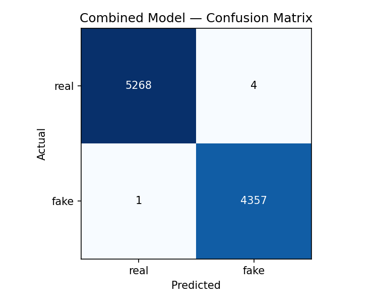

# AI-Generated Personas on Social Media are Growing, Here's How We're Fighting Back!

## Hook
You've probably interacted with one and never knew it. AI-generated profiles are increasing in social media. They have a realistic face, believable bio, and even followers. They're designed to look real, and for most people, they do.

## Problem Statement
Anyone with access to a free AI tool can generate a photorealistic face in seconds and pair it with a fake Instagram profile. These personas are being used to run scams, spread misinformation, and manipulate real people, including you, children, teenagers, and adults. Social media platforms currently have no reliable, automated way to catch these accounts before they do damage. By the time a fake account is reported and removed, financial or emotional harm may have already been done.

## Solution
We build a system that looks at two things simultaneously: the profile picture and the account's behavior. Our tool analyzes whether a profile photo was generated by AI, and whether the account's activity, like follower counts, post history, and username patterns, matches the behavior of a real person. In testing, our system correctly identified fake personas with over 99% accuracy, menaing platforms could use this tool to automatically catch fake accounts and flag a warning to other users when they come across the profile.

## Chart

**What this chart shows:** Each box represents the accounts our system reviewed. The top-left and bottom-right show correct detections. Real accounts correctly identified as real, and fake accounts correctly flagged as fake. The goal is to keep the other two boxes as close to zero as possible, meaning we rarely mistake a real account for fake or vice versa. Our system achieved over 99% accuracy across nearly 10,000 accounts.